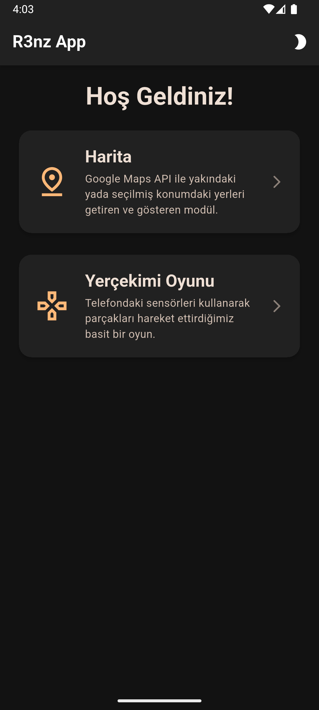
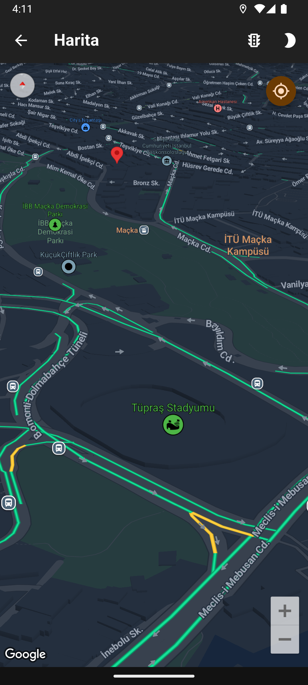
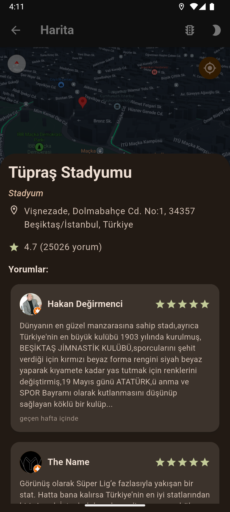
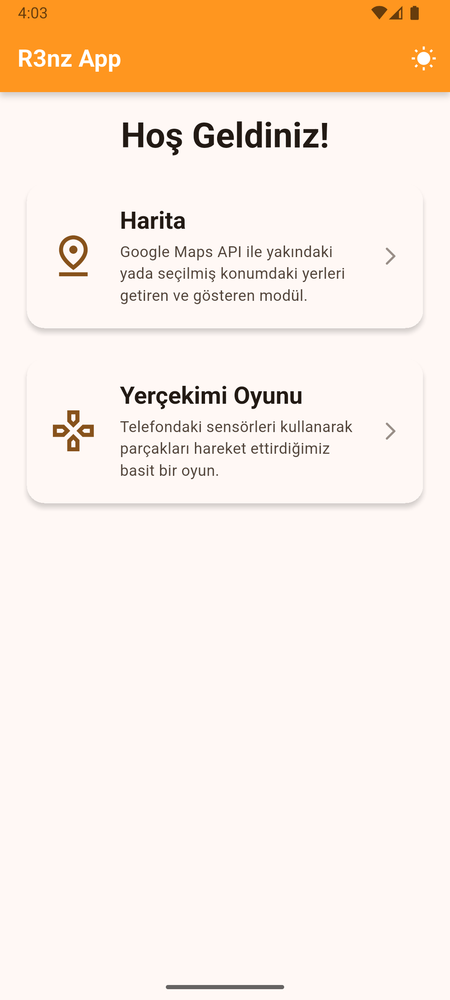
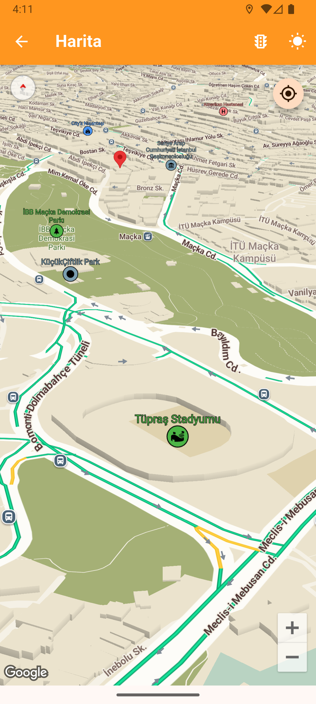
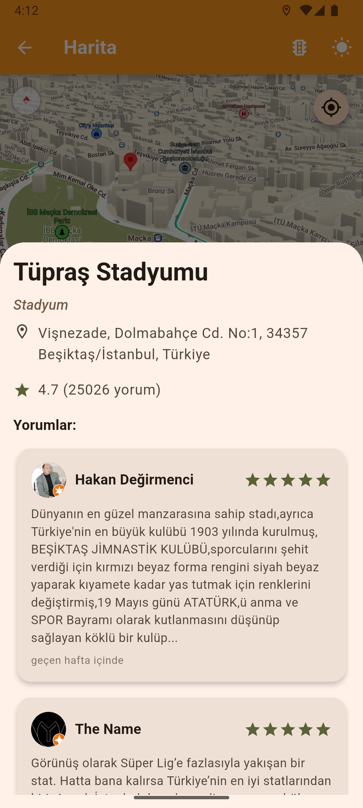

# NarPOS Demo Projesi

Bu projeyi, **NarPOS firmasında işe alım sürecim için özel olarak geliştirdim.** Projeye başlarken kullanılan tüm diller ve teknolojiler bana yabancıydı; **12 gün içinde sıfırdan öğrenilerek bu proje ortaya çıkarıldı.** Bu bir demo ve eğitim projesi niteliğindedir, bu nedenle bazı eksikleri veya geliştirilebilecek yönleri olabilir.

---

Flutter ve ASP.NET Core tabanlı bir mobil uygulamadır. Uygulama, kullanıcının konumuna veya seçtiği konuma yakın yerleri keşfetmesini sağlar ve içerisinde Flame2D ile geliştirilmiş bir mini oyun barındırır.

## ✨ Temel Özellikler

- **Hibrit Arama Mimarisi:**
  - **Client-Side Arama:** Backend servisine ulaşılamadığında, uygulama doğrudan Google Places API'ye "nearbySearch" isteği göndererek (maksimum 20 sonuçla) temel işlevselliği sürdürür.
  - **Gelişmiş Backend Arama:** Backend, Google'dan gelen sonuçları kendi PostgreSQL veritabanındaki mevcut yerlerle birleştirir ve zenginleştirir. Bu sayede, arama yapılan konuma yakın, daha önce kaydedilmiş işletmeleri de içeren 20'den fazla sonuç döndürebilir.

- **Dinamik ve Etkileşimli Harita:**
  - **Çift Tema Desteği:** Uygulama genelinde ve harita üzerinde tam **Açık (Light)** ve **Koyu (Dark)** tema desteği. Tema, uygulama çubuğundaki bir buton ile anında değiştirilebilir.
  - **Özelleştirilmiş Harita Stilleri:** Her tema için özel olarak tasarlanmış, estetik harita stilleri.
  - **Konum Odaklı İşlemler:** "Konumuma Git" butonu ile haritayı anında kullanıcının mevcut konumuna odaklar.
  - **Esnek Arama Tetikleme:** Kullanıcı, kendi konumunu temsil eden marker'a tıklayarak veya haritada herhangi bir yere uzun basarak yeni bir arama noktası belirleyip çevredeki işletmeleri listeleyebilir.

- **Dinamik Marker Üretimi:**
  - Varsayılan sıkıcı harita pinleri yerine, Google Places API'den gelen `iconMaskBackgroundColor` ve `iconMaskUri` verileri kullanılarak `marker_generator.dart` içerisinde anlık olarak Flutter widget'ları çizilir. Bu widget'lar `BitmapDescriptor`'a dönüştürülerek haritada estetik ve bilgilendirici ikonlar olarak gösterilir.
  - Her bir işletme ikonu tıklandığında, o yere ait detaylı bilgileri (isim, adres, puan vb.) gösteren bir "Bottom Sheet" açılır.

- **Flame2D Mini Oyunu:**
  - Flutter'ın güçlü oyun motoru **Flame2D** ve cihazın **ivmeölçer sensörleri** kullanılarak geliştirilmiş eğlenceli bir parçacık simülasyonu içerir.

- **Güçlü Backend ve Veritabanı:**
  - **RESTful API:** ASP.NET Core ile geliştirilmiş bir API.
  - **Veri Kalıcılığı:** PostgreSQL veritabanı; işletmeleri (Places), bu işletmelere ait yorumları (Reviews) ve yapılan API sorgularının kayıtlarını (Logs) verimli bir şekilde depolar.

## 🛠️ Kullanılan Teknolojiler

- **Backend:** C#, ASP.NET Core, Entity Framework, PostgreSQL, PostGIS
- **Client:** Dart, Flutter, Google Maps Flutter, Flame2D, Geolocator, Sensors Plus
- **API:** Google Maps Flutter SDK, Google Places API

## 🚀 Kurulum ve Çalıştırma

### Backend

1.  `backend/` dizinine gidin.
2.  `appsettings.json` dosyasındaki veritabanı bağlantı dizgesini ve Google API anahtarınızı güncelleyin.
3.  Bağımlılıkları yükleyin: `dotnet restore`
4.  Veritabanını oluşturun: `dotnet ef database update`
5.  Projeyi başlatın: `dotnet run`

### Client

1.  `client/` dizinine gidin.
2.  `client/.env` ve `client/android/secrets.properties` dosyalarına Google API anahtarınızı ekleyin.
3.  Bağımlılıkları yükleyin: `flutter pub get`
4.  Uygulamayı çalıştırın: `flutter run`

## 📸 Ekran Görüntüleri

## Karanlık Mod

    
    
    

## Aydınlık Mod

    
    
    

